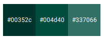
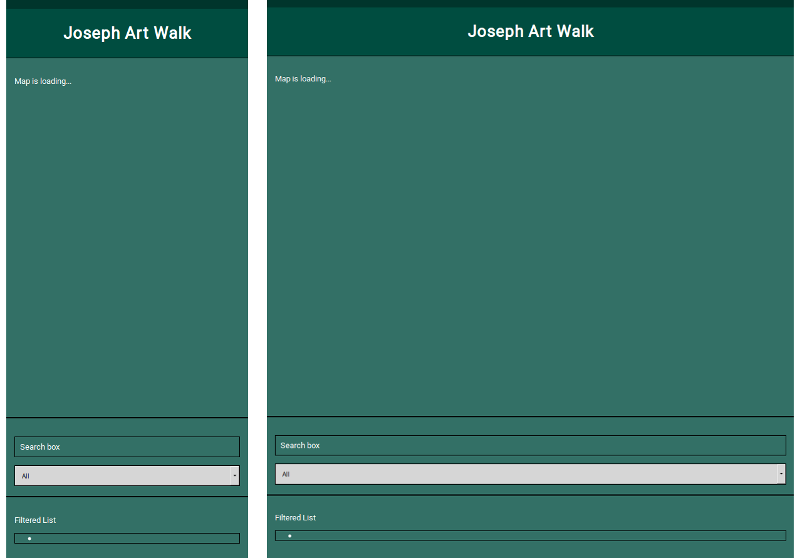
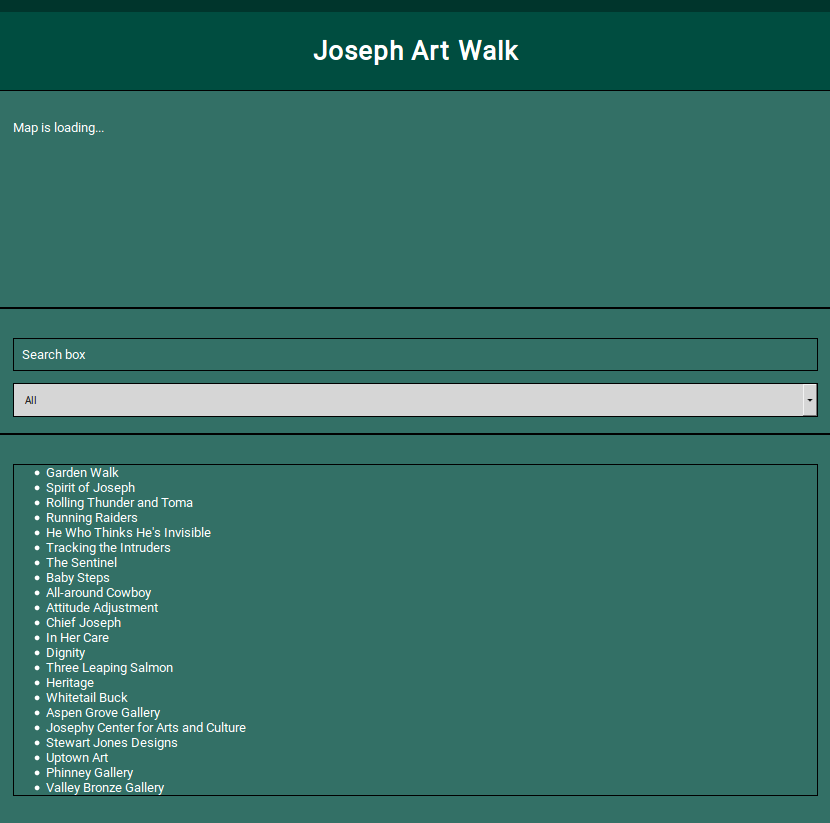
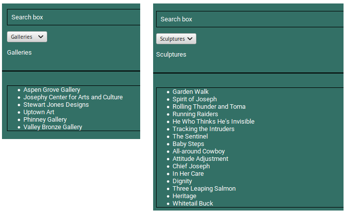
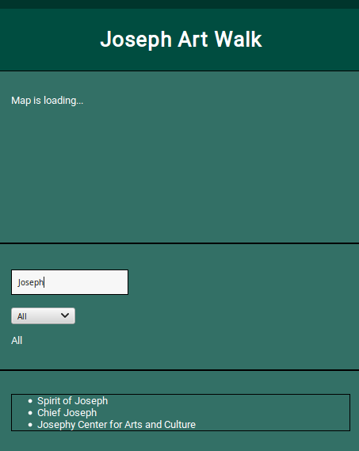
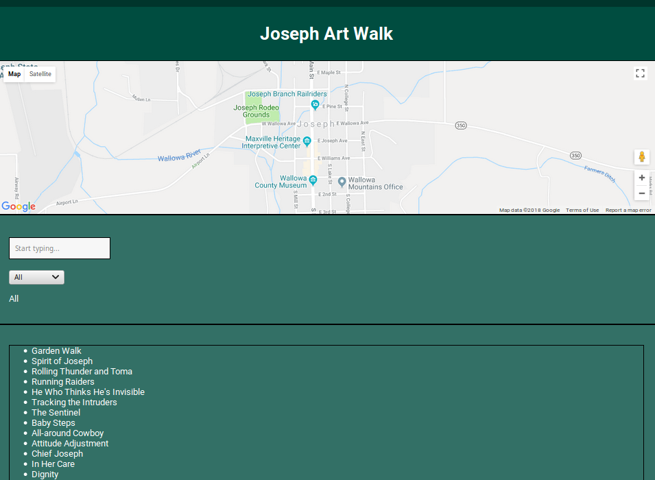

# Joseph Art Walk

This app uses [Knockout.js](http://knockoutjs.com/), the [Joseph Art Walk API](https://api.josephartwalk.org/), and the [Google Maps API](https://developers.google.com/maps/documentation/javascript/tutorial) to show the locations and some background information on the bronze statues and art galleries along Main Street in Joseph, Oregon.

## Why KnockoutJS?

KnockoutJS works on the MVVM design pattern where the UI is separated into three parts:

1. The **model** consists of the list of gallery and statue locations with artist info, verbose location, latitude and longitude, title, and other supporting information. 

1. The **view** consists of the UI in the webpage seen by the end user, namely the map object and its properties (size, popup info windows, markers), a list of locations in text form, and a search box and dropdown menu for the user to filter that list. 

1. The **view-model** binds the model and view so the user can make updates to the model through the view's search box an dropdown menu; any updates to the model are immediately reflected in the view for the user to see. 

## Feature Requirements

### Model

The call to the [Joseph Art Walk API](https://api.josephartwalk.org) returns a list of locations, which are stored in the global `locations` object and used to instantiate the ViewModel.

|Example Property|Example Value|
|----------------|-------------|
|artist|"Ramon Parmenter"|
|artistURL|"http://josephoregon.com/ramon-parmenter"|
|location|"in front of The Dog Spot"|
|lat 45.35149|
|lng -117.229985|
|corner|"1st St and Main St"|
|medium|"bronze"|
|title "Garden Walk"|
|imgSrc|""|
|imgAttribution|""|
|imgLicense|""|
|imgLicenseLink|""|
|arttype "statue"|||

### View

The page is a responsive, mobile-first design.

This is a single page application.

The color palette was generate from [Material-UI](https://material-ui.com/style/color/):

The font is Roboto from Google Fonts.

The user interface items in the view are:

- Header with centered title
- Section for app introduction
- Google map to display markers
- Search box
- Dropdown menu
  - All
  - Galleries
  - Statues
  - None
- Unordered list of locations
- Footer

### View-Model

The map must be no more than the height and width of the screen. The user must be able to continue scrolling on the page and not get hung up in the map. Whenever it is updated, the map must update its bounds.

Clicking on a map marker must show an infoWindow. 

The list of all locations must be displayed on a vertical list. 

Tapping on a marker or on a list item must activate that specific marker animation and show the info window of that marker in the map window.

Tapping again on the same marker or list item must activate the animation again and hide the info window of that marker in the map window. 

The search box must, with every typed character, filter the visible map markers and the list of items in the locations list. 

The dropdown menu must also filter the visible map markers and the list of items in the locations list. 

There must be an additional graphic to reset all inputs. 

## Screenshots

`commit #eed94b0: feat: Add basic html and css [view]` 

`commit #752ea83: feat: Create and bind markers list [mv]`

The observable arrays in Knockout are only observable at the level of the array themselves, so the View-Model will know to re-render the array if an element is added or removed, but not if an element is changed. The elements themselves are not observable. The trick is a somewhat dirty hack from [this StackOverflow question](https://stackoverflow.com/questions/13231738/refresh-observablearray-when-items-are-not-observables).

`commit #22c3721: feat: Manage observable markers array, update list`

The displayed list of statues and galleries now refreshes smoothly with every keystroke in the search box. 

`commit #bd8f273: feat: Add and bind the search box`

Once the two asynchronous API calls are working, the blank map is visible and the rest of the functions are prototyped to return strings to console.log() and the program architecture is finalized. 

Both calls are asynchronous, but the Google Maps API callback `initMap` binds the ViewModel, which itself calls the Joseph Art Walk API. If the Maps API call fails, though, the rest of the app never loads, which is a problem. 

`commit #fa02e10: refactor: Prototype remaining functions`

